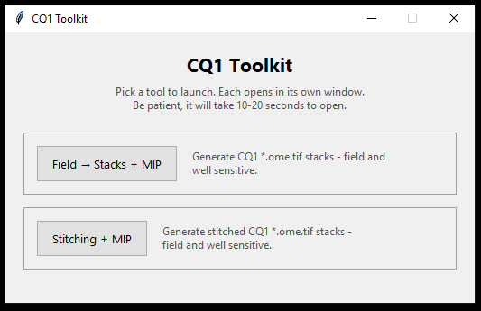

# Yokogawa CQ1 Image Processing Toolkit

Two Windows tools for processing images from a Yokogawa CQ1 microscope —
no Python, no coding, no admin rights needed to run them.

## Get the toolkit

**[⬇ Download the latest release](https://github.com/mschrmschr/yokogawa-cq1-image-processing-toolkit/releases/latest)**

1. On the release page, download the `.zip` file (e.g.
   `CQ1_Toolkit_v1.0.0_win.zip`) under **Assets**.
2. Unzip the whole folder anywhere — Desktop, Documents, a network share.
   Keep everything inside it together; don't pull files out individually.
3. Open the unzipped folder and double-click `CQ1_Toolkit_Launcher.exe`.
4. Pick a tool from the launcher window and follow its GUI.



That's it — nothing to install first. The window can take 10–20 seconds to
open the first time; that's normal, just wait.

If Windows SmartScreen or your antivirus blocks the exe as "unrecognized
publisher," that's expected for an unsigned internal tool — click
"More info" → "Run anyway," or ask IT to allow it.

For full step-by-step instructions once it's open (which tool to pick, how
to fill in "Channel names," handling a plate with mixed staining, where your
results land, and troubleshooting), see [`How_to_use.md`](How_to_use.md) —
the same content also ships inside the zip as `README.txt`, next to the
launcher exe.

## What the two tools do

- **Field → Stacks + MIP** turns each CQ1 field into one proper
  multi-channel image stack, then makes a quick-look overview image.
- **Stitching + MIP** stitches CQ1 tiled wholemount scans into one big image
  per well, then makes the same kind of overview image.

Both point at the same kind of dataset folder — one containing CQ1's own
`MeasurementResult.ome.xml` file and an `Image\` subfolder of raw images —
and both ask you to type in your real channel names (DAPI, GFP, etc.),
because CQ1 itself only ever labels them generically ("CH1", "CH2"). See
[`How_to_use.md`](How_to_use.md) for guidance on which tool fits your data.

---

The rest of this page is for people building the toolkit from source —
not needed just to run it.

## Repository layout

This repo holds **source only**. Each tool also has its own `build_exe.ps1`
(`build_launcher_exe.ps1` for the launcher) that produces a PyInstaller
`--onedir` build in a local `dist/` folder — intentionally not committed
here (thousands of numpy/matplotlib/pandas dependency files, fully
rebuildable from source, not something a git repo should hold).

```
CQ1_Toolkit_Launcher/
  launcher.py                 tiny Tkinter launcher, no pipeline imports
  build_launcher_exe.ps1

CQ1_FieldtoStacks_parallel_MIP/
  gui.py                      single-dataset GUI front end
  checklist_widget.py         shared Tk "Wells" checklist widget (byte-identical
                               copy in both tool projects, see repo layout note)
  ome_xml_assembler.py        raw CQ1 tiles -> per-field/well OME-TIFF stacks
  mip_plotter.py               MIP + colorized panel PNG generation
  run_from_config_ome_parallel.py   batch/CLI entry point (jobs_ome.json)
  jobs_ome.example.json       copy to jobs_ome.json and edit for your data
  jobs_ome.schema.json
  requirements.txt
  build_exe.ps1

CQ1_Stitching_Wholemount_MIP/
  gui.py                      single-dataset GUI front end
  checklist_widget.py         shared Tk "Wells" checklist widget (byte-identical
                               copy in both tool projects, see repo layout note)
  main.py                     routes to the stitcher backends (classic/seamless/tiny)
  stitcher_unified.py         tile stitching backends (classic/seamless/tiny)
  ome_metadata.py             CQ1 OME-XML -> per-tile metadata CSV
  mip_plotter.py               MIP panel PNG generation
  run_jobs.py                 batch/CLI entry point (jobs.json)
  jobs.example.json           copy to jobs.json and edit for your data
  requirements.txt
  build_exe.ps1
  README.md                   developer notes: FIJI-compatibility details,
                               stitch backend tradeoffs, bug history
```

`checklist_widget.py` is intentionally duplicated rather than shared via an
import, for the same reason the two tools aren't merged into one PyInstaller
build (see `CQ1_Toolkit_Launcher/` above) — each tool has to stay independently
buildable with zero cross-project import dependency.

## Requirements (building/running from source)

The release zip needs none of this — it's only for working with the Python
source directly. Each tool is Python 3 + its own `requirements.txt`:

- `CQ1_FieldtoStacks_parallel_MIP`: `numpy`, `tifffile`, `matplotlib`, `lxml`
- `CQ1_Stitching_Wholemount_MIP`: `numpy`, `pandas`, `tifffile`, `tqdm`,
  `imagecodecs`, optionally `ome_types` (recovers channel names from OME-XML
  when reading a stack back)
- `CQ1_Toolkit_Launcher`: no third-party dependencies — Tkinter from the
  standard library only

## Building from source

Each tool builds independently with PyInstaller, from a conda/venv with that
project's `requirements.txt` installed:

```powershell
cd CQ1_FieldtoStacks_parallel_MIP
.\build_exe.ps1
cd ..\CQ1_Stitching_Wholemount_MIP
.\build_exe.ps1
cd ..\CQ1_Toolkit_Launcher
.\build_launcher_exe.ps1
```

Then assemble the shippable folder: copy `CQ1_Toolkit_Launcher\dist\
CQ1_Toolkit_Launcher\*` to a `CQ1_Toolkit\` folder, copy
`CQ1_FieldtoStacks_parallel_MIP\dist\CQ1_FieldtoStacks_parallel_MIP` to
`CQ1_Toolkit\tools\FieldToStacks`, copy `CQ1_Stitching_Wholemount_MIP\dist\
CQ1_Stitching_Wholemount_MIP` to `CQ1_Toolkit\tools\Stitching`, and add
`How_to_use.md` as `README.txt` alongside the launcher exe.

Real job configs (`jobs.json` / `jobs_ome.json`) are gitignored since they
can contain real dataset paths — copy the `.example.json` file in each
project and edit it, or use each tool's GUI instead.

## License

MIT — see [`LICENSE`](LICENSE).
